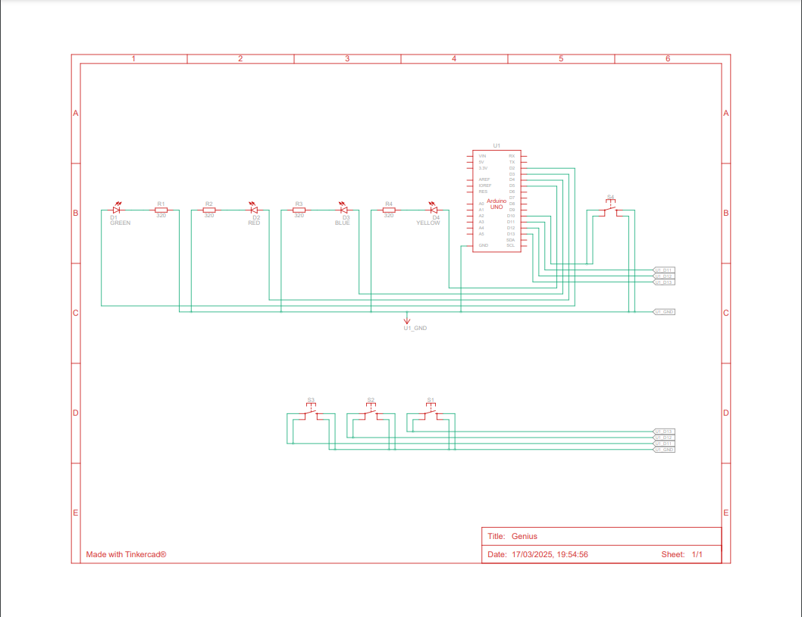

# 📌 Jogo da Memória Genius com Arduino

---

## 📝 Descrição  
Este projeto é uma recriação do clássico jogo Genius (Simon Says) utilizando um Arduino. O objetivo do jogo é testar a memória do jogador desafiando-o a repetir sequências de luzes que aumentam de tamanho a cada rodada.

O jogo funciona da seguinte forma:

O sistema exibe uma sequência de LEDs piscando em ordem aleatória.  
O jogador deve repetir a sequência pressionando os botões correspondentes.  
Se acertar, a sequência aumenta e o jogo continua.  
Se errar, o jogo reinicia e exibe um efeito de erro.  

## 🎮 Demonstração  
  
EM breve

## 🛠 Hardware e Componentes Necessários 
Arduino Uno (ou qualquer outra placa compatível)  
4 LEDs (verde, vermelho, azul e amarelo)  
4 botões (um para cada LED)  
Resistores para os LEDs e botões  
Jumpers e protoboard   

## 🏗 Montagem do Circuito  

## 💾 Instalação e Configuração  
Baixe e instale a Arduino IDE se ainda não tiver.  
Conecte o Arduino ao computador via cabo USB.  
Carregue o código para a placa usando a IDE Arduino.  
Monte o circuito conforme o esquema acima.  

## 🚀 Como Jogar  
1° O sistema gera uma sequência aleatória de cores (representadas por LEDs).  
2° O jogador deve pressionar os botões correspondentes na mesma ordem exibida.  
3° Se o jogador acertar toda a sequência, uma nova rodada inicia com uma sequência mais longa.  
4° Se errar, o jogo reinicia e uma animação de erro é mostrada.  

## 🛠 Melhorias/Futuro Desenvolvimento 
Implementar sons para cada botão utilizando um buzzer.  
Exibir a pontuação em um display LCD.   
Criar diferentes níveis de dificuldade.  
Melhorar a responsividade dos botões adicionando debounce.   

## 🌐 Link do TikerCad / Wokwi  
### [TinkerCad: Clique Aqui](https://www.tinkercad.com/things/aAKppsnFzs8-genius?sharecode=UaW9gg2KYOfzSiSrVxvB8C2h7H4ZucAHtrOcceI4apY)
### [Wokwi: Clique Aqui](https://wokwi.com/projects/425458814227054593)
